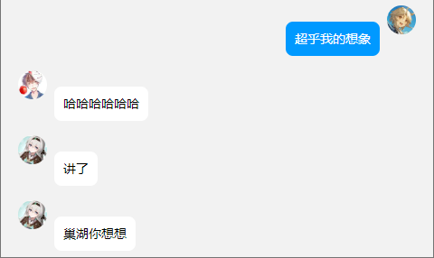
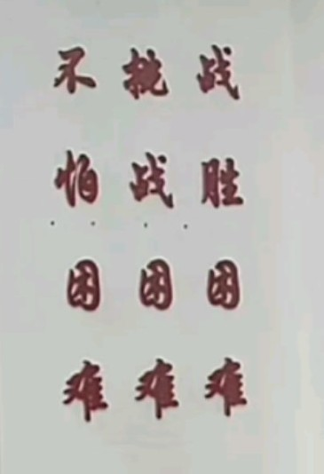
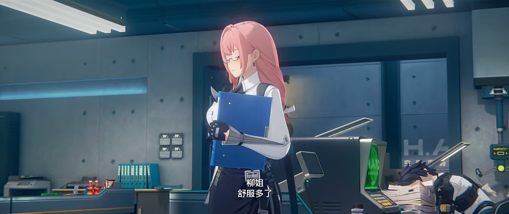
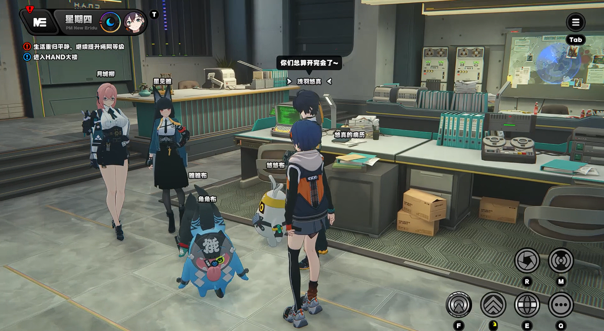
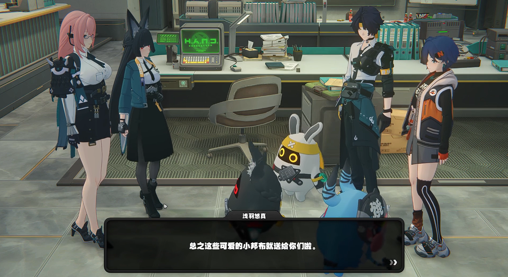
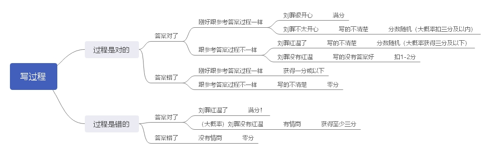
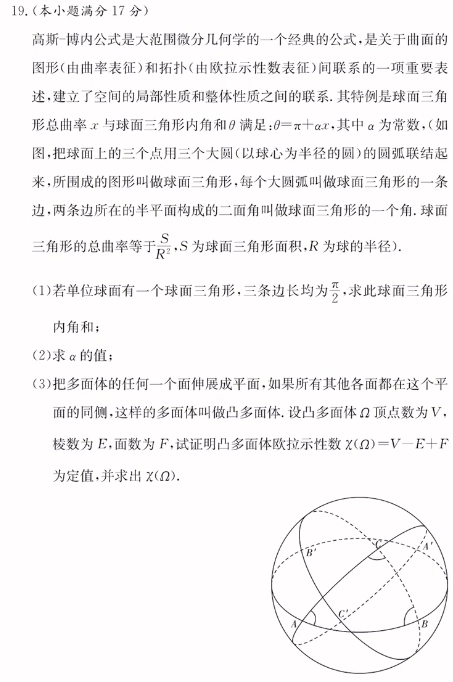
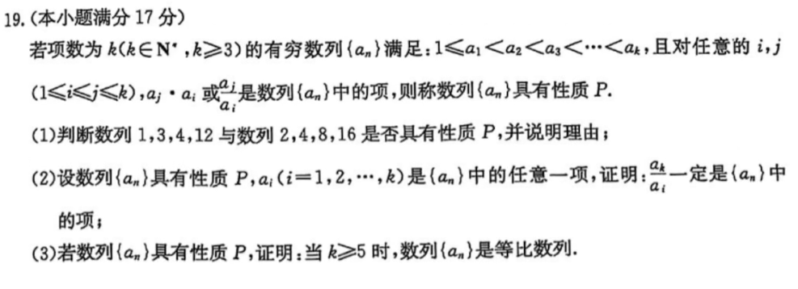
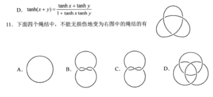

# Part I. 探究：Graphcity 的记忆系统

> **案例一**
>
> 词义辨析：contact / contest / content / context / contract / contrast
>
> 我知道！分别是联系 / 比赛 / 满意的 / 文本 / 合同 / 对比！
>
> **案例二**
>
> 词义辨析：adapt / adept / adopt
>
> 我知道！分别是适应 / 精通 / 采纳
>
> **案例三**
>
> 词义辨析：contrary / contradictory / controversial / contradict
>
> 我知道...吗？我不会啊！

分析：graphcity 在记忆英文单词时，采用的哈希算法可能是记忆它的前 $k\ (k\le 5)$ 个字母和它的含义。但当部分单词过于相像时，graphcity 可能会将其放入连续的内存区一起记忆（如案例二）。如果一些单词含义类似，前 $k$ 个字母差别不大时，可能会造成哈希冲突。

> **案例一**
>
> discipline：纪律
>
> interdisciplinary：~~有纪律的~~ 跨学科的
>
> remark：评论
>
> remarkable：~~可以评论的~~ 引人注目的
>
> agree：同意
>
> agreeably：~~同意地~~ 愉悦地
>
> sequence：序列
>
> consequence：~~序列？~~ 结果

分析：graphcity 在面对自己熟悉的子串时，会自动进行语义推断。但英语确实是一门神奇的语言，语义推断此时有可能会失效。~~完形填空中尤其可能出现这种特殊情况~~

> **案例一**
>
> 君人者，诚能见可欲则思知足 __ 自戒；将有作则思知止 __ 安人；念高危则思谦冲 __ 自牧；惧满溢则思江海下百川；乐盘游则思三驱 __ 为度；忧懈怠则思慎始 __ 敬终；虑壅蔽则思虚心 __ 纳下；想谗邪则思正身 __ 黜恶；恩所加则思无因喜 __ 谬赏；罚所及则思无因怒 __ 滥刑。
>
> CPU 烧了。
>
> （正确答案：以；以；而；以；而；以；以；以；而）
>
> **案例二**
>
> 引壶觞 __ 自酌，眄庭柯 __ 怡颜。倚南窗 __ 寄傲，审容膝 __ 易安。园日涉 __ 成趣，门虽设 __ 常关。策扶老 __ 流憩，时矫首 __ 遐观。云无心 __ 出岫，鸟倦飞 __ 知还。景翳翳 __ 将入，抚孤松 __ 盘桓。
>
> 我知道正确答案！以；以；以；之；以；而；以；而；以；而；以；而。
>
> **案例三**
>
> (  ) 自其变者而观之，(  ) 天地曾不能以一瞬 (  )； (  ) 自其不变者而观之，(  ) 物与我皆无尽 (  )。
>
> CPU 烧了。
>
> （正确答案：盖将；则；/ ；/ ；则；也）

分析：graphcity 在记忆文言文时，会自动压缩不影响文义的信息（如虚词）。一般而言可以通过自动推断得出正确的虚词是什么。当虚词过于无序时可能会导致混乱。但当虚词较为有规律时，可能会额外对其进行特殊记忆。

若一个句子前后有较多不同的虚词，自动推断有大概率失效。

> **案例一**
>
> 纵一苇之所如，（                            ）？
>
> ~~我知道：举匏樽以相属！~~ 正确答案：凌万顷之茫然。
>
> **案例二**
>
> （                            ），或植杖而耘耔。
>
> ~~我知道：挟飞仙以遨游！~~ 正确答案：怀良辰以孤往。
>
> **案例三**
>
> 一夫作难而七庙隳，(                        )，(                            )，何也？
>
> 数十怜人困之，(                          )，(                        )。
>
> CPU 烧了。
>
> （正确答案：身死人手，为天下笑者；而身死国灭，为天下笑）

分析：graphcity 在记忆文言文时，采用的哈希算法可能是记忆它的字数和大意。如果两个句子字数相同，且意思过于相近，可能会造成哈希冲突。

> **案例一**
>
> 问：是否所有的浆细胞都是由 B 细胞产生的？
>
> 答：是的。
>
> 正确答案：不是的，因为 **还有一部分是记忆 B 细胞产生的。**

分析：😓

graphcity 在记忆概念时，可能会进行自动推断（如记忆 B 细胞是 B 细胞）。在面对这种出题人发电的判断题中，自动推断可能会出问题。

> **案例一**
>
> 理想斜面实验的提出者是（         ）。  
> 提出万有引力定律的是（        ）。  
> 测量万有引力常量的是（        ）。  
> 测量静电力常量的是（        ）。  
> 地心说的集大成者是（        ）。  
> 提出日心说的是（        ）。  
>
> 错误答案：牛顿；牛顿；牛顿；卡文迪许；亚里士多德；哥白尼。
>
> 正确答案：伽利略；牛顿；卡文迪许；库伦；托勒密；哥白尼。
>
> **案例二**
>
> 细胞学说中，研究植物的是（        ），研究动物的是（        ）。
>
> 发现分离定律的是（        ），自由组合定律的是（        ）。提出基因在染色体上的假说的是（        ），证明的是（        ）。
>
> 正确答案：施莱登；施旺；孟德尔；孟德尔；萨顿；摩尔根。

分析：😓

我在退役前从来没有想到过高考会考这玩意。graphcity 在记忆时，从来不会记忆人名。

> **案例一**
>
> ——你知道你初中班上有多少人吗？
>
> ......不知道。
>
> ——你知道你初中班上有多少男生吗？
>
> ......不知道。
>
> ——你知道你中考成绩吗？
>
> .......不知道。
>
> ——你知道你体育中考的成绩吗？
>
> 知道，我扣了两分。
>
> ——你知道你爸妈多少岁了吗？
>
> ......不知道。
>
> ——你知道你妹妹多少岁了吗？
>
> ......不知道。
>
> ——你知道你多少岁了吗？
>
> 我靠，我好像忘了！不过我知道还差一岁就能解除防沉迷了。

分析：graphcity 在记忆数字时，通常只会记住 10 及以内的数字。如果需要记忆的数字超过 10，那么他可能会通过转换法来记忆。

> **案例一**
>
> 你知道一条抛物线的 27 个不同的二级结论吗？
>
> ——我知道一个，$AF=d(A,l)$。
>
> 你知道一个椭圆的 15 个二级结论吗？
>
> ——我知道两个，$AF_1+AF_2=2a$，$S=b^2\tan\dfrac{\theta}{2}$。
>
> 哦现在还多知道了一个，那就是光学性质。~~八省联考害人不浅。~~

分析：graphcity 只会记忆多次长期接触到的，或者令人印象深刻的二级结论。面对一般的二级结论题目时，他可以向你表演现场推一个二级结论。

如果偶遇出题人恐怖如斯，针对冷门二级结论出题，则拼尽全力无法战胜。

> **案例一**
>
> （12 分）人出生前，胎儿的血红蛋白由 $\alpha$ 珠蛋白和 $\gamma$ 珠蛋白组成，出生后人体血红蛋白则主要由 $\alpha$ 珠蛋白和 $\beta$ 珠蛋白组成。研究发现，$\alpha$ 珠蛋白位于 16 号染色体上的两个串联基因 $\alpha_1,\alpha_2$ 控制，$\beta$ 和 $\gamma$ 珠蛋白则分别由位于 11 号染色体上的 $B$ 和 $D$ 基因控制。调控珠蛋白合成的基因发生缺失或突变，引发的血红蛋白异常的疾病，称为地中海贫血。根据缺陷基因类型不同，将地中海贫血分为 $\alpha$ 珠蛋白地中海贫血（$\alpha$ 地贫）和 $\beta$ 珠蛋白地中海贫血（$\beta$ 地贫），某患 $\alpha$ 地贫遗传病的家庭中父亲及其孩子的基因组成即表型如下表所示：
>
> |      |                    父亲                    |                    女儿                    |                    儿子                    |
> | :--: | :--------------------------------------: | :--------------------------------------: | :--------------------------------------: |
> | 基因组成 | $\alpha_1^+\alpha_2^0$ / $\alpha_1^0\alpha_2^0$ | $\alpha_0^+\alpha_2^+$ / $\alpha_1^0\alpha_2^0$ | $\alpha_1^+\alpha_2^+$ / $\alpha_1^0\alpha_2^0$ |
> |  表型  |                   中度贫血                   |                   中度贫血                   |                   轻度贫血                   |
>
> 注：$\alpha^+$ 表示基因正常，$\alpha^0$ 表示基因缺失。
>
> 回答下列问题。

分析：😓 让我们说中文。

当 graphcity 遇到不讲人话的中文时，可能会在中英文模式之间混乱，短时记忆能力大幅度下降。

> **案例一**
>
> 你还记得本文的第一个案例是什么吗？

分析：graphcity 的短时记忆能力仅限于现代文阅读 II / 英语阅读 D 篇。如果遇到不讲人话的作者 / 出题人，短时记忆的限度可能会下降。

# Part II. 人物赏析：浅羽悠真

前情提要：

- **「悠真精神」及其实践**

可以用一张图来概括浅羽悠真所体现出的「悠真精神」：

显然应该要横着读而不是竖着读。

> **2025 长沙市适应性考试作文**
>
> 「松弛感」现在一般指面对压力时不慌张，不焦虑，从容应对，善待自己的心理状态。2024 年巴黎奥运会期间，中国队 00 后小将出征奥运表现出的「松弛感」引人瞩目。他们面对压力应对自如，以「新时代的松弛感」展现满满的青春自信，取得了令人信服的比赛成绩。

悠真的松弛感，令人羡慕。

- 面对压力应付自如，背后是他超凡的强大实力：

从小拥有极强的以太适应体质，常被称作「天才」，在学校毕业后以格外优异的成绩进入对空部。同时，拥有「以太适性衰竭综合征」的他，在晚期发病时仍然坚持在空洞中调查，并在身体衰竭的前一刻仍然可以屏息凝神，一发命中敌人。

- 作为「请假学资深执行官」，在善待自己方面无人能及：

> 投稿人：月城柳
>
> 留言：我一直认为，如果浅羽能把他在偷懒方面的灵感用在其它地方，他做什么都会成功的。
>
> 

性格自由散漫，我行我素，追求以最小的成本达到任务及格标准。在高效率地完成最低可交付标准的工作后，就会心安理得地抓紧一切时间休息（摸鱼）。同时声称自己选择弓作为武器是因为方便偷懒，可以有效减少跑动的频次。

> 浅羽的指导任务顺利完成了，新队员们对「悠真真前辈」的评价很棒：「不管是与以骸周旋还是清理攒了一周的垃圾袋这样的杂物都能给予妥帖的指导和协助」，但也有「虽然悠真前辈根本没在现场出现，但那台搜救员邦布真的很可靠」这样令人困惑的报告内容 ......

- 表面上不慌张，不焦虑的他，实际上背负着许多：

<iframe src="//player.bilibili.com/player.html?isOutside=true&aid=113679261505072&bvid=BV1FLkzYsEDe&cid=27521845996&p=1" scrolling="no" border="0" frameborder="no" framespacing="0" allowfullscreen="true"></iframe>

他随时都有以骸化的风险。头上的发带是他师傅的遗物，颈部的装饰是为了掩盖密布的针孔，身上散发出的香草味则是长期服药留下的药味。当有人问及他的身体时，他也总是微微一笑地带过。

他常常申请病假，没有人知道他用这些假期做了什么，但多半不是在休息。

以太适性衰竭综合征的患者通常寿命较短，现有案例中寿命最长的患者在 26 岁那年去世。目前尚未存在完全治愈该疾病的方法。

- **循此苦旅，终抵繁星**

大家如果注意过的话，我的洛谷主页 slogan 已经在一个月之前就换成了这句话。

为什么呢？其实我不知道。

很多时候我都比较难用言语去表达我的喜爱之情，比如现在。

悠真的生命旅途绝对可以称得上是「苦旅」：

先天患有绝症，年幼时被父母抛弃，长大后被师傅收养，但实则是当作试验品来利用；面对随时以骸化的风险，他总是担心能不能被他人和社会接受。

那「繁星」又是从何而来的呢？

一方面，他收获了足够的关爱。

不管是对空六课的朋友们，还是录像店的哲玲兄妹，正如他的绘本里面所描述的那样，「不管你有怎样的力量，变成什么样子，都是我们的伙伴」。悠真的师傅则在生命的最后关头加紧研制针对悠真的药物，即使变成以骸也要死死守卫仅存的特效药。在阴差阳错之下，悠真也成功拿到了师傅的特效药，在生命垂危关头起死回生。

另一方面，他对生活有足够的热忱。

他是一个细致入微的人，给对空六课成员们送的邦布中会根据原主人的性格特点加入一些特别的数据。

如果你把他惹毛了，那他可能会毛茸茸地走开，「惹到我，你们可真是惹到棉花了~」

在他的代理人秘闻中，面对和他处境相似的孩子们，不惜自己一人代替他们，抽取三人量的脊髓液避免他们受到更多的伤害。

在这个破破烂烂，千疮百孔， 却又灿烂至极的世界里，总有坏的事存在， 但也总有美好的事情发生。

为什么总有人会去追求希望？为什么总有人会为世界上所有的美好而战？我不知道。

但你如果问我会不会这样做，我的答案是肯定的。我也相信绝大多数人的答案都是这样。

# Part III. 漫谈：高考数学中的应试与思想性

前情提要：[OI 后日谈 1](https://www.luogu.com.cn/article/99lqwq4i)

假如下一届 / 下下届 / 下下下届的数学老师是刘晖的话，你可能需要这个《刘晖使用手册》：

假如你写了一个理论正确的过程得到了正确的答案，你可能会多次听到「写的不清楚」这五个字。这个时候，切记不要惊慌，这并不意味着你的过程哪里有问题，而是大概率它跟参考答案不一样而已。

这样的改卷方法在大多数题目是有效且比较合理的（包括 18 题）。但问题就出在这个不知道在干什么的 19 题。

在 19 题，你可以见到：

> **1 / 选拔欧拉**
>
> 
>
> 评价：😓
>
> 这样的题你能和参考答案写的一样，要么是你和出题人看到了同一个视频，要么你是欧拉。

> **2 /  彩票抽奖**
>
> 
>
> 这道题本身还可以，但问题出在阅卷标准上：第三问跟参考答案不一样，即使使用了正确的 / 部分正确的做法（如归纳等），大概率会获得小于 2 分的分数。
>
> 虽然这个阅卷标准对于每个人是公平的，但它显然并不合理，如果写过程要跟抽奖一样得分的话，那干脆不要给过程分算了。

当然高考数学有问题的地方显然不止这一个。

我很理解出题人为了提升难度想要去给试卷来点花，但直接把大学知识下放然后来创人，这样也太不道德了。

一个臭名昭著的例子就是今年的八省联考：

出题人疑似有点太喜欢拓扑了。这么考完全是出题人没有能力的体现。

- **新定义：创新与问题并存**

在高考从 22 题改成 19 题的第二年，无数的新定义题出现在了各大月考，联考和高考试卷中。一方面，这是高考数学试图摆脱应试技巧，模版作答和二级结论的尝试，但另一方面也同样带来了很大的问题。

一个优势在于：能够分配在难题的时间更多了。删掉一道多选，填空和大题，就意味着我们可以投入更多时间和精力到难题上面。思考时间将会更加充分，也可以减少在简单题上的失误概率。

另一个优势在于：好的新定义题的确可以很有思想性。比如去年的新高考 I 卷和今年的长沙市联考，思路没有很难（想到 key observation 就可以解决问题），也没有超脱高考考纲，更没有无脑照搬大学知识。

**（Update：长沙市联考的阅卷真的是妈妈生的）**

但新定义题是否能够做到瑕不掩瑜呢？说实话并没有明显的这种感觉。

1. 直截了当的说，我们远远比（绝大多数）出题人和阅卷人聪明。
2. 新定义题的无脑化和套路化。具体而言，就是：照搬大学教材，直接考察其中的一个结论；照搬大学教材，给出一个毫无用处的新定义套壳，把套壳去掉之后就是传统的导数 / 解析几何题。这样的题目有没有训练价值？会不会在高考考察？我认为是没有的，高考也不会考这种无聊的东西。
3. 有相当多的新定义题三个小问之间毫无关联，或者几乎没有提示性。如果第三问非常脑筋急转弯，这就是一个灾难。
4. 阅卷过程中出现的问题。当你的解法与参考答案不一样时，你的分数完全取决于阅卷人的知识水平和他的精神状态。传统的按步骤给分在解法千奇百怪的新定义题面前并不适用。一个比较正常的解决办法是出一道解法相对单一的题目，但很显然月考和联考的出题人暂时还做不到这一点。
5. 为啥还有专门针对新定义题出的教辅啊？？？真的有任何用吗？？？？？？？
6. 其实我也不知道老师是怎么备课这种新定义题的。我们的数学老师是直接针对特定的题目出成专题然后 ~~出无穷多个变式~~。这个能不能做到举一反三，触类旁通的效果是未知的（这个也会引出后面的一个问题）。更重要的是，我到现在还没看到两道有关联的新定义题啊？？？

- **高中数学教育：应试与思想平衡**

我感觉高中数学老师都有一个特点：高考走到哪，他们就走到哪。

这样做的好处是显而易见的。在传统的高考模式中，这样做显然是最保险且有效的措施。

但是现在好像出了一点问题：高考好像走在了他们前面比较远。

在一些基础题（包括某些导数和解析题），追求和参考答案的一致性是正常的，因为 ~~正常人也写不出来除了参考答案以外的做法。~~。但是新定义题这样做可能会出现一些问题。过于强调和参考答案达成一致，可能会失去一些很有意思 / 很棒的 idea（比如一些归纳，调整，或者感性理解）。同时也没有啥有效的办法在新定义题中让你的答案跟参考答案长得一样。

另外参考答案也会有很多「不知道为什么要这样做」的步骤。不像一些 codeforces 题目会给出 hint，参考答案显然是没有也不可能会有这些的。但是 hint 恰恰又是一道题目最关键的部分。这样就可能会导致一个问题：我已经会了这道题，但是又不会这道题。

实际上这个问题不只出现在新定义题当中。在很多导数题和解析几何题，我们不会做显然不是因为我们不会极值点偏移 / 端点效应 / 非对称韦达 / 齐次化等技巧，而是我们不知道什么时候用，或者根本没想到能够用它。高考中一道题留给我们的时间可能只有 20min 不到，试错的成本是比较高的。这个时候，能够快速找准这个题目有什么关键的提示信息至关重要。

一个很棒的事情就是很多高中老师非常擅长解决传统题。他们可以在讲解题目的过程中把自己的一些解决思路融入进去。美中不足的点在于我一直期待有一个专门讲解 hint 的专题，但是现在好像并没有。

所以我就自己尝试整理了一些可能有共性的题目。尽管我现在可能讲不清这里面共同的 hint 到底是什么，不过有很多 hint 确实是比较难表达的。期待雅礼的数学老师们有一个更加系统的理解。

（传送门：[感受这股劲.jpg](https://www.luogu.com.cn/article/wnew69w0)，[利用橘子洲大桥跨过湘江](https://www.luogu.com.cn/article/z3prmunt)，[利用调整法解决一系列极值点偏移问题](https://www.luogu.com.cn/article/6lx3piza)）

对于新定义题，实际上教学的最好方法可能就是——跟竞赛教练一样，找一些优秀的，具有教育意义的题目然后给学生去做。不去刻意进行教学可能就是最好的教学。

我特别喜欢一个讲座的标题：《信息学奥赛中的直觉与证明》，出自 WC2022 的第一课堂。~~尽管里面的内容我可能已经忘得差不多了~~，但是这个标题我是百分之百认可的。hint，或者说直觉，就是解决一道题目最最最重要的东西。有了一个正确的直觉真的可以秒了一切。

- **我们的学习是否会过拟合化？**

这是我在 B 站看到的一个很有意思的观点。如果把我们的大脑看成 AI（实际上可能就是的），把学习当作喂数据的话，我们的学习是否会过拟合化？

这个问题其实我以前一直也想过。对此我给出的答案是肯定的。如果大量去做同质化严重，缺乏思想性和教育意义的题目，思维很有可能会被固化。

这个就呼应了我前文提到的一个事情：对于新定义的某一道特定题目，会不会真正加深我们对于这道题目蕴含的理论的理解？其实我觉得不太会。

我已经看到过很多题目套一个数列的壳，实际上在考进位制 / 位运算的知识。这些题目（应该可以说是）本质一模一样的，虽然长得可能不太一样。不过我在网上和在课上都没怎么听过有老师提到这个东西，更多的是在就题论题。就事论事是个很好的习惯，但是用在这里就感觉有点怪怪的。如果一个学生做了很多这种题目，看了很多所谓的参考答案，会不会对进位制本身有比较深入的理解呢？或者碰到另一道不太一样但本质相同的题目就歇菜了呢？我不知道，因为还没有人做过这个实验。~~感兴趣的可以试试。~~

这个东西用在其它学科（包括 OI）其实也是一样的。当我们题目做的足够多的时候，我们是否只会做自己曾经做过的题目？（当然这也不完全是一件坏事，如果你做过的题目足够足够足够多的话，那可能可以覆盖绝大多数考点了）

这个东西也肯定不是「死读书」或者「死学习」那么......什么样呢？我也不好形容，但我感觉这两个东西不太一样。遇到一道题目的时候，大家肯定更倾向去使用自己熟悉的套路或者做法。久而久之，我们面对类似问题时，可能就丢失了去思考的能力，而只会去自己的记忆库中寻找解法。这个确实应该是人的正常生理反应（为了追求更高的解决问题的可能性和效率的正常选择），而不是说我主动放弃了自己的思考去背答案。一个是（应该可以说是）不太能避免的一个东西，另一个完全就是自己主观意愿可以操控的东西。

有人可能就会说：我刻意地不去思考熟悉的解法不就行了吗？可以尝试一下，在月考的时候碰到了考前一天做过的原题，然后在月考写一个新的解法。相信一个正常人应该没有这么大的自控力去抛弃近在眼前的答案。

总而言之，就是：

1. 重复训练大量同质化的习题会导致过拟合化。
2. 过拟合化是正常的。不能把过拟合化和死读书混为一谈。

这个时候就会有一个很矛盾的问题：我该怎么解决过拟合化的问题呢？如果我太久不去碰类似的问题，可能直接会把它忘掉；如果再去做的话，又可能导致过拟合化的加深。

大多数人的解法就是直接利用题海战术。我把所有的套路做一遍不就行了吗？不得不说这种类似于以毒攻毒的做法确实有很好的效果。不过现在出现了新定义题，再这样做恐怕是会出一些问题的。

实际上，我们只需要意识到过拟合化这个东西的存在，很多由此引发的问题自然就会缓解（至少不会在高考的时候暴雷）。在平常的练习当中，可以试着去探究题目中更加本质的 idea，然后多去进行一些广泛的联想。

特别提示：

1. 本文不适用于语文，英语等科目。
2. 如果你连试卷都做不完 / 或者数学 8 分之类的话，同样不适用于本文。

# Part IV. 回顾与展望：覆灭重生

距离我上一次发 OI 后日谈，好像已经三个月了。

在这三个月的时间里面，其实是有点迷茫的：月考成绩一直都在 300 名上下，六科里面每次都是随机挑选两科考的好，其它科目要么一般要么坠机了。

因为这个，我们班主任和年级主任都来找我谈过话，不过好在并没有施加一些压力。他们确实并没有怎么担心这件事。比较担心这件事的是我爸，~~但由于我已经把他屏蔽了所以没咋影响到我。~~

在这三个月中的很多时间，我都在想一件事情：什么时候可以运气好一点，让更多科目同时在一次月考中上来呢？

这个问题自然是没有答案的。你也就考了这么几次考试，根本就不可能知道你在某一科考好的概率是多少。

但是好就好在你确实可以通过一些方式提升你某一科考得好的概率。

回顾一下这三个月都干了什么：

1. 自学了有机化学和水溶液的离子平衡。现在整张化学试卷我都可以看懂了！
2. 基因工程学完了。现在整张生物试卷我也可以看懂了！
3. 光学，热学和近代物理学完了。现在整张物理试卷我也可以看懂了！
4. 把原来一些用在主科的时间花在了副科，尤其是化学。顺便补了一下之前考试中看都没看一眼的有机题。
5. 降低了自己对于数学考试的期望。作为一个正常人，能够高水准地完成一周三套，75min 选填+最后三道大题，有的时候还是刘晖编的数学试卷，显然是不可能的。

然后就快到 2025 了。

<iframe src="//player.bilibili.com/player.html?isOutside=true&aid=113713302476284&bvid=BV16BCAYdEe7&cid=27526564132&p=1" scrolling="no" border="0" frameborder="no" framespacing="0" allowfullscreen="true"></iframe>

《绝区零》确实是一个很有意思的游戏。在 1.4 以前一直都是不温不火的一个状态。我们班上玩家最多的也不是原神或者铁道，而是绝区零。在我们都以为它会一直把这个状态持续下去的时候，1.4 版本来了。

制作组真的在这个版本给足了诚意和热情。主线的终章，两个动画短片，底层机制的优化，~~还有白送的浅羽悠真~~。绝区零也在 1.4 版本（可以说是）迎来了自己的第二次新生。

说实话，我确实有一些感动。在它的第一季报幕中，使用的音乐是它的公测宣传曲《覆灭重生 Come Alive》。这个使用真是恰到好处。在语文阅读里面，这个就是完美的首尾呼应，照应全文情节。从一开始的覆灭，再到现在的重生，真的能够给人带来一种振奋人心的力量。

再接下来就是 2025。

2025 的第一场考试就是长沙市联考。在考试之前，我的内心还是充满了不确定，尤其是做了去年的适应性考试试卷之后。好巧不巧的是，在考试前一周，我还发烧了。发烧的那几天几乎没有什么心思搞学习，基本上做完作业之后就难受到直接睡觉了。

但是好就好在我在考试之前基本上恢复了。更重要的是，发烧还变相地保障了我的睡眠时间和睡眠质量，这个非常棒！

考试的那段时间，可以说是「悠真精神」的成功应用。基本的考试策略就是：有思路的就做，没思路的就跳。整个考试的过程也是比较顺利，~~因为不会做的都跳了~~，除了英语听力。那个男的听力播报员真的是妈妈生的，我从头到尾没听清过它一句话。

然后就到了发成绩的那个晚上。当我看到考试成绩的时候，真的完完全全被震惊到了。

**班级排名：2**

**年级排名：43**

我从来没有想过这个成绩会出现在长沙市联考。太可怕了。

这是我第一次语数英的选择题全对。物理单选从错两个变成了错一个，化学从错五个变成了错两个，生物单选也是第一次全对，两门赋分科目分数都是在 90 左右。

当然也存在一些问题：在本场考试中，出现包括但不限于：多选想要加一个选项结果涂卡的时候涂到了单选题的位置；选择题涂的时候整体错位了；试卷上改了答案但是答题卡上没改 $\cdots\cdots$

好在这些错误都在检查的时候发现了，~~要不然就出大事了。~~ 

不过，现在的任务应该是好好休息一下，考试的时候确实有点太紧张了。

**（Update：我的寒假作业可能并不想让我好好休息）**