从夯到拉评价我上过的清华大学大一上课程：

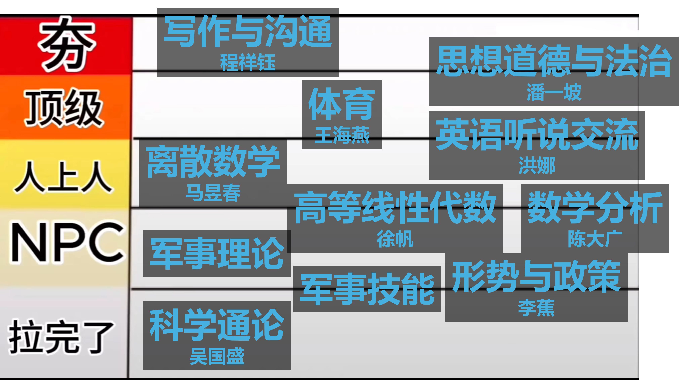

- **「科学通论」吴国盛 / 1.0**

完美兼顾了任务量大、小班讨论尴尬、大班课不知道在讲什么、老师夹带私货等作为一门烂课的必要条件。

每两周一次的 1k 字小论文，原本前期我还想认真写的，后面交给 deepseek 认真写了。

小班讨论主要是助教锐评各个同学提的问题不是问题，所以提问环节我也交给 deepseek 了。

感觉这门课应该从「科学通论」改名成「宗教通论」或者「古希腊哲学通论」。

- **「形势与政策」李蕉 / 1.5**

这门课主要是 deepseek 在上，所以我也没法评价。

- **「军事技能」/ 1.8**

感觉军训的很多环节都莫名其妙的。我也不知道领导为什么让我们罚站那么多次。

但是我们教官人很 nice！任务量很小，相比其他教官也比较友善温和，没有那么大的官威。

拉练很有成就感！就是中间上厕所的时间太短了，上了厕所就没时间休息了。

- **「军事理论」/ 2.0**

感谢小蓝！4.0 还是很轻松的，不听课只靠开源材料都能做到。

- **「高等线性代数」徐帆 / 2.5**

由于我只去了三节课，我对徐帆老师的唯一印象就是 ~~他是我在清华上过课的男老师里面最帅的。~~

但是，你的期中和期末，怎么能够这！么！！难！！！

已放弃线性代数。

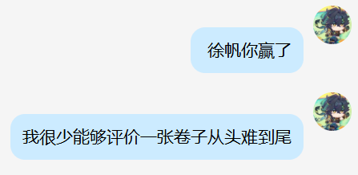

- **「数学分析」陈大广 / 2.7**

求你了，期末考试不要考定义，行吗

虽然我也没怎么上过课，但我知道他很会爆典。

dgchen 自行车定律：为什么自行车两个轱辘能动起来？

感觉和致理另一个教数学分析的老师比起来还是比较友善的。

本学期达成成就：所有数学课的习题课零到场。

这也导致了我还不认识任何一个助教。

- **「离散数学」马昱春 / 3.0**

如果没有 pcf 我对这门课的评分还可以再高一个档次。

马老师人很好，上课非常积极！感觉很有教学热情的一个老师！

就是离散这门课我也不知道讲了什么，感觉讲的也挺离散的。

- **「英语听说交流」洪娜 / 3.8**

1/5 的概率被我拿到了！！1

其实课程本身没有什么太大的意思，可能英语听说交流就是这样。拿一些材料听，然后填空或者做选择，然后和同桌交流一下。老师上课还会时不时点人回答问题，但老师很宽容，如果你上课走神了或者答不出来也没有任何关系。

每周会有 speaking 和 listening assignment（期末的几周因为要期末 role-play 所以提前结束了）。听写的任务从来都不检查，做不做也没关系。speaking 就是每周找一段材料来读。老师人很好，不管读成怎么样都给满分，还会非常细致的给出改进建议！！

最困难的可能是期中配音表演和期末的 roleplay。期中是给一个 3-5min 的动画短片配音，可以拿台词，和队友稍微排练一下就可以了。比较困难的是期末的 roleplay，5-8 个人完成一个 25-30min 的英语剧本，全程需要脱稿。那几周真的超级忙：期末的 roleplay 和写作与沟通的课堂展示撞上了，真的是「做完你的做你的」。

不过感觉完成一个这么庞大的 roleplay 是一个非常有成就感的工作！基本上剧本的选择和改编、排练的统筹规划，走位安排，还有一些道具设计都是我一手操办的。~~（主要是组员们太会潜水了导致的）~~ 不过好在大家都非常配合，能够共同想出一些很棒的 idea，中间即兴表演的部分也很好，最终也是平稳落地了！！

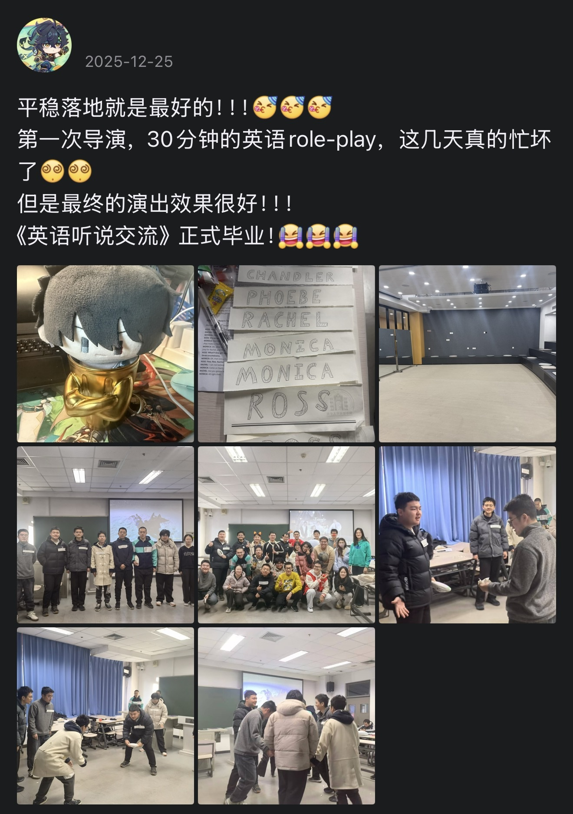

- **「体育」王海燕 / 4.0**

虽然我们体育的时间很烂，午睡还没多久就要强制唤醒参加体育课，每次到体育馆整个人都没恢复过来。

但我们的老师真的，特别特别的有精神，用现在流行的话讲就是「多巴胺」！她每次热身的时候都会放歌，让我们跟着律动来进行热身动作。我在体育课真的有被她的精气神和教学热情给感染到。

虽然我们体育课的任务量比其它课可能要大，训练基本不带停的，但就像老师说的，「体育课就是你付出越多，收获一定越多的课」，「上我的课一定会出汗」。

很可惜，下个学期应该是上不了她教的课了，不过我相信她带给我们的精气神能够在之后的体育课中一直延续下去。

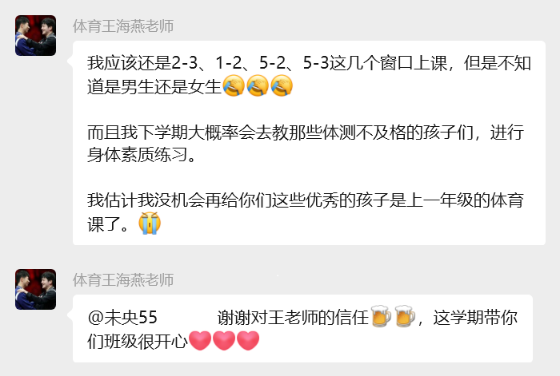

- **「思想道德与法治」潘一坡 / 4.5**

所有人，都给我去上潘一坡！我宣布潘老师是我的男神！！！

他真的，特别好老师！！！作业只有期中总结 + 一次小组讨论，期末四道题里面，两道提前给，一道自己出，剩下一道考试的时候二选一。而且还开卷！！

每次上课之前都会给一张「思想道德与法治」主题的小卡片，上面是一些名人名言。而且，他每次上课前还会发早餐！！！我这个学期的所有早餐都是在他的课上吃的，谢谢潘老师！

潘老师上课也特别有意思，能够从生活现象出发，最终上升到对思想道德的思考。中间还有一些很有意思的，豆包绘制的插图。

我还特别喜欢小组讨论的环节！跟我的室友分到了同一组。感觉我们小组整个就是特别 nice，分工也非常明确，大家做事情效率很高，讨论很顺利。关于「情绪价值」的小组讨论我还摇到了一位心理医生，也感谢她无私的帮助！最后我们小组讨论的效果特别特别好！特别有节目效果！真的是比我们预想的要有趣的多，完全完全超出了预期。点燃了 ppt 之魂！

潘老师对每个人都特别认真，期中总结会有一对一的专门反馈，会给每位同学一个关键词，还送了一支对应关键词的笔！我特别喜欢他最后一节课把所有的小组讨论全部拼起来，组成了「我们」两个字，给每个小组讨论都颁了奖，真的特别特别用心。

希望我们都能像潘老师结课时说的那样，「在浩瀚星空中，找到属于自己的轨道」。         

明年形势与政策，我还跟潘老师！

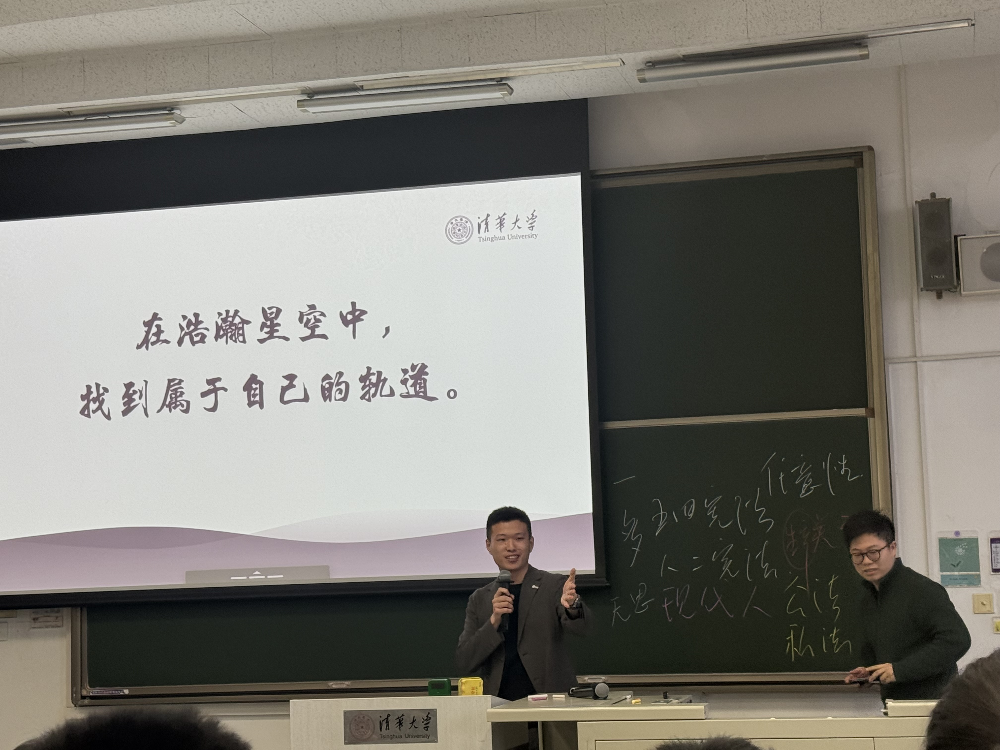

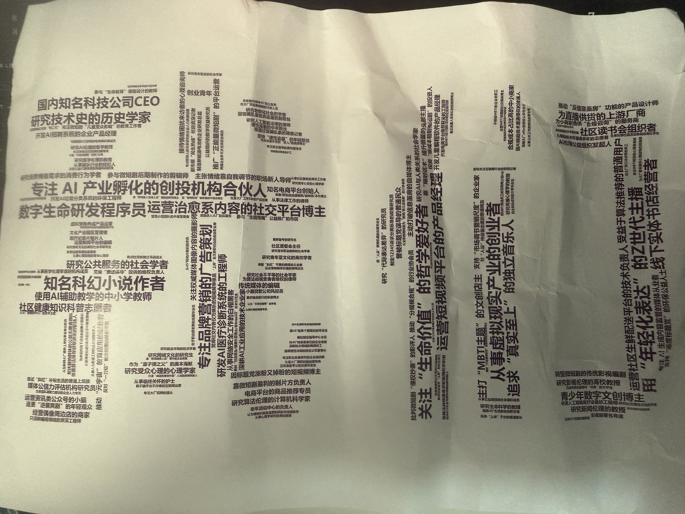

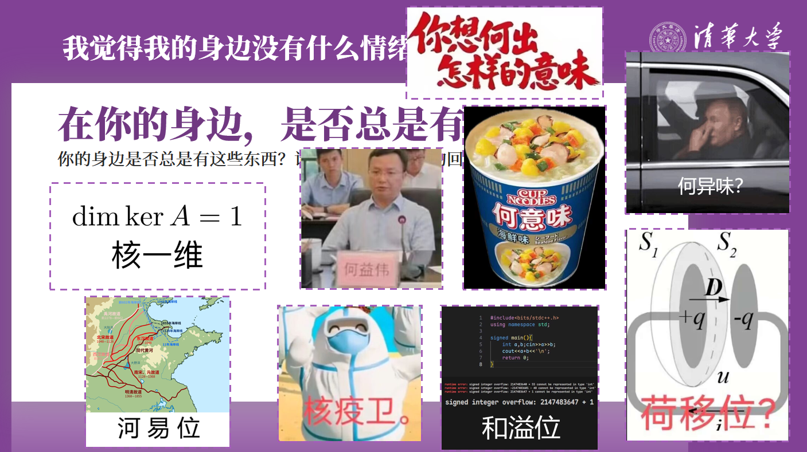

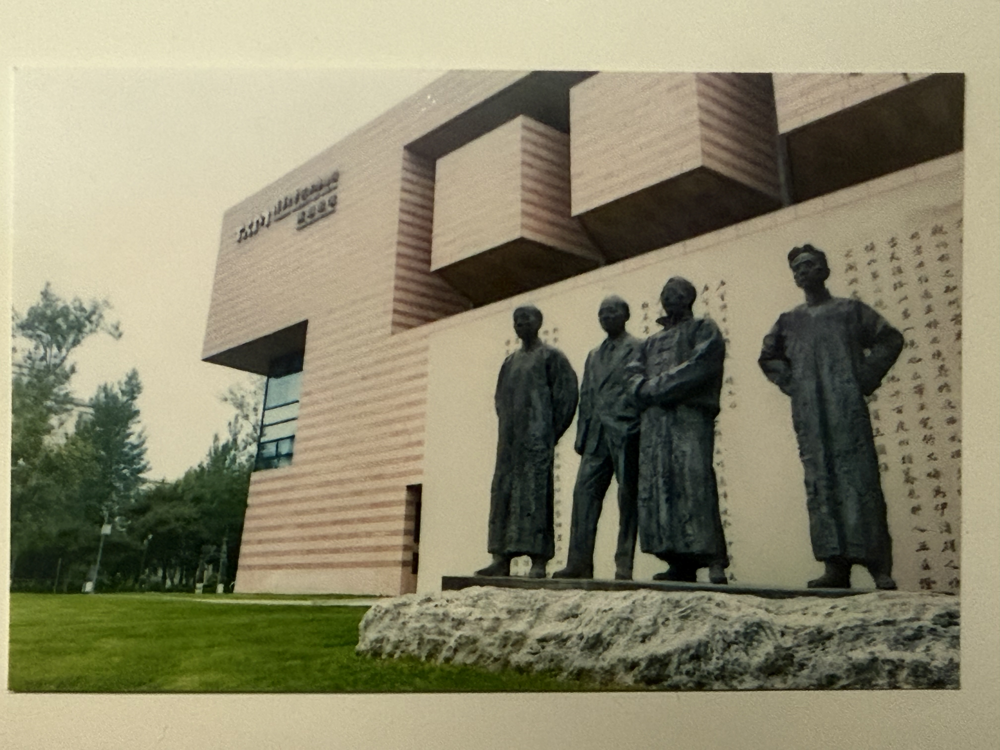

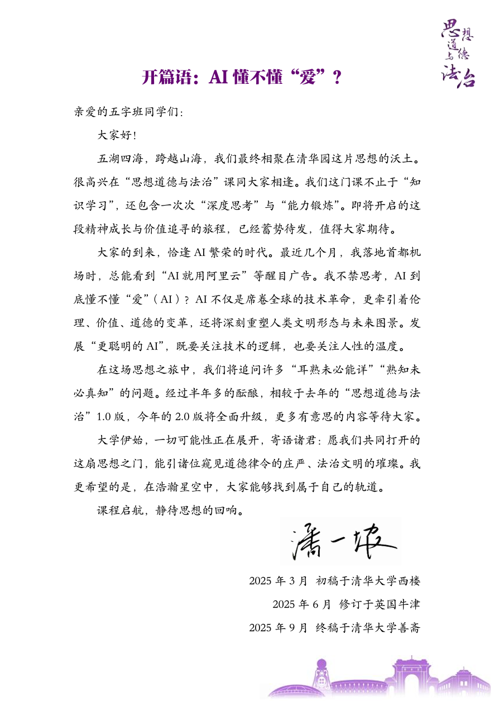

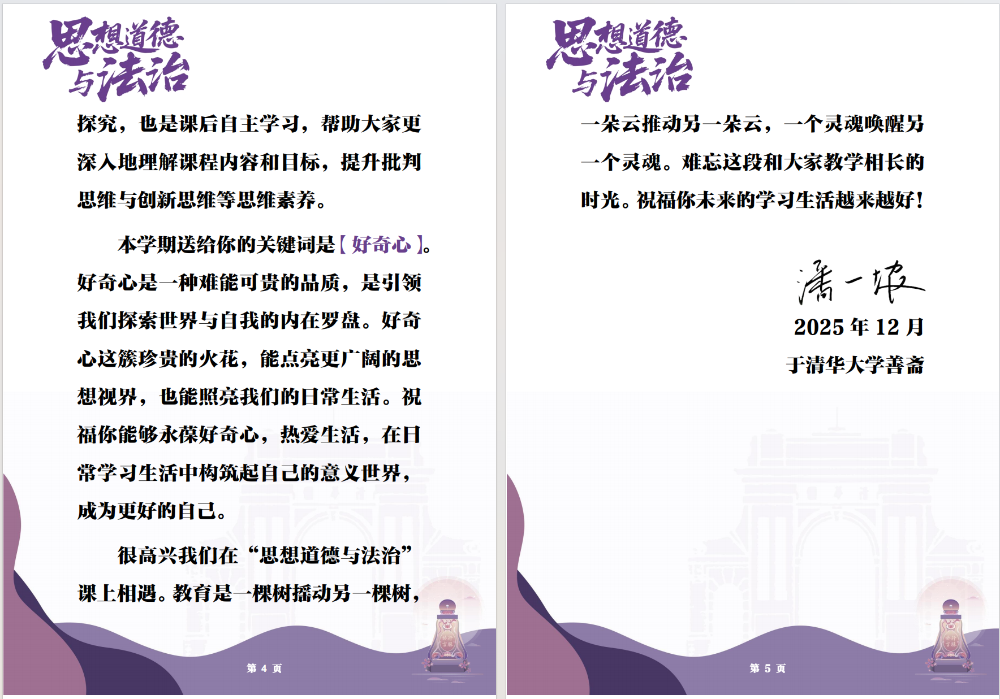

- **「写作与沟通 - 游戏与文化」程祥钰 / 5.0**

对于这一门课的评价，它值得我单开一篇文章。下面只是简单说说：

如果你只是对游戏感兴趣，想水过这一门课，那请你不要报程老师的课。他的任务量很大：策划游戏展，准备稿（2k）+初稿（5k）+终稿（5k），学术海报设计，对比阅读评价，5min课堂展示。他也是一个要求比较严格的老师，他希望你能够在这一门课上真正做到「思辨读写」的要求，能够从具体的切入口入手，通过经验关照，学理论说的方式构建一篇科学，严谨又不失批判张力的文章。

如果你想要通过这一门课，锻炼自己高中及以前缺失的思辨能力，解决一个真正困扰自己的，有价值的问题，那请你无论如何都要报程老师的课。你可以在他的课上真正学到很多不管是写作还是生活上都非常有用的东西，真正让自己的思维变得深刻锐利，而非在言语上变得尖锐刻薄。写作的过程确实是「痛并快乐着」的过程，我本人终稿也改了不下四次，但是能够看到自己的论文能够全方位的更加成熟，更加「有用」，这个过程是相当有成就感的。

我相信这一门课是受益终身的。

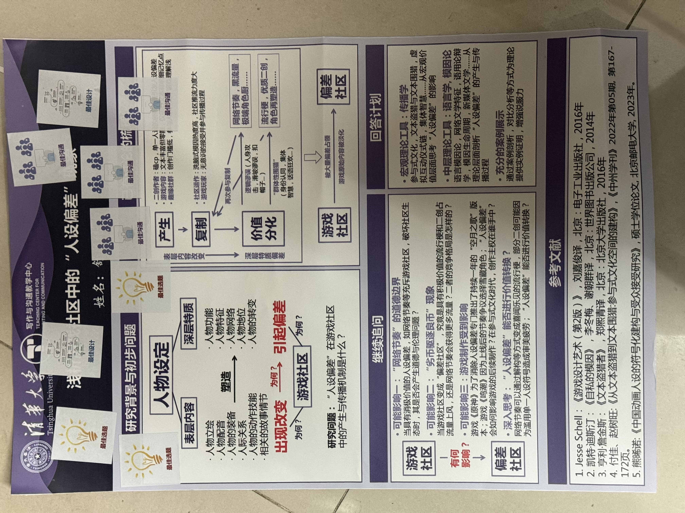

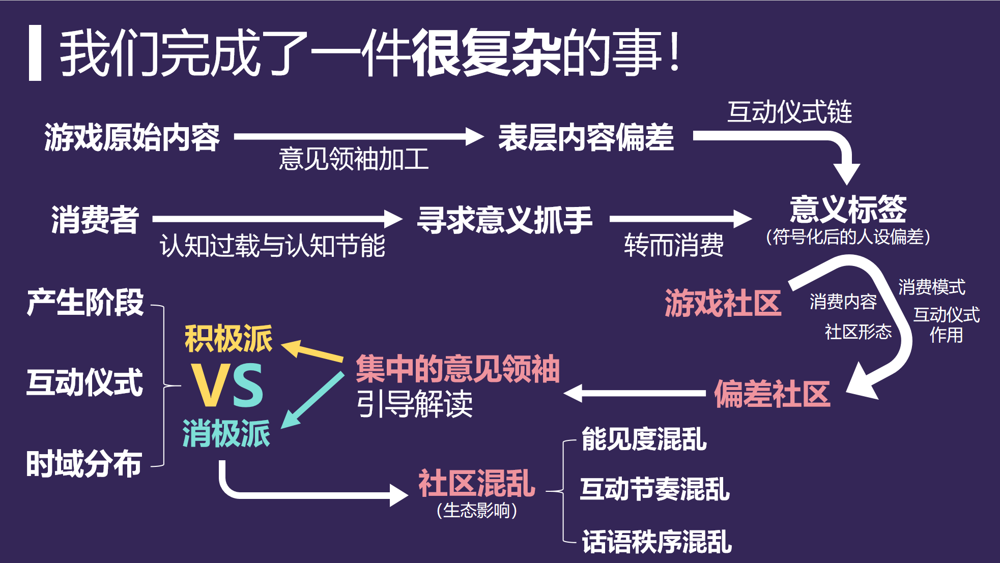

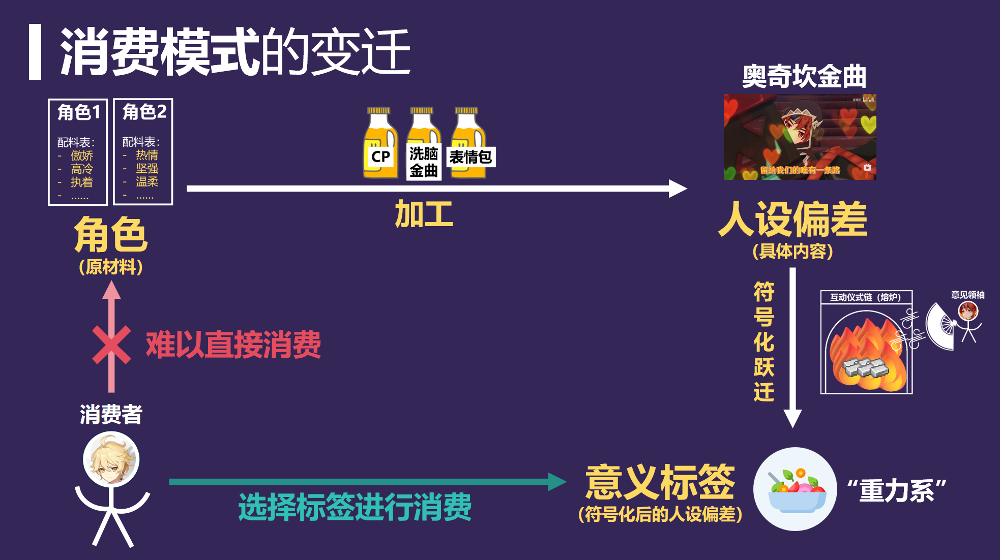

