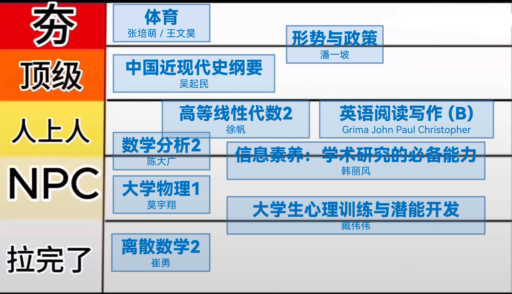
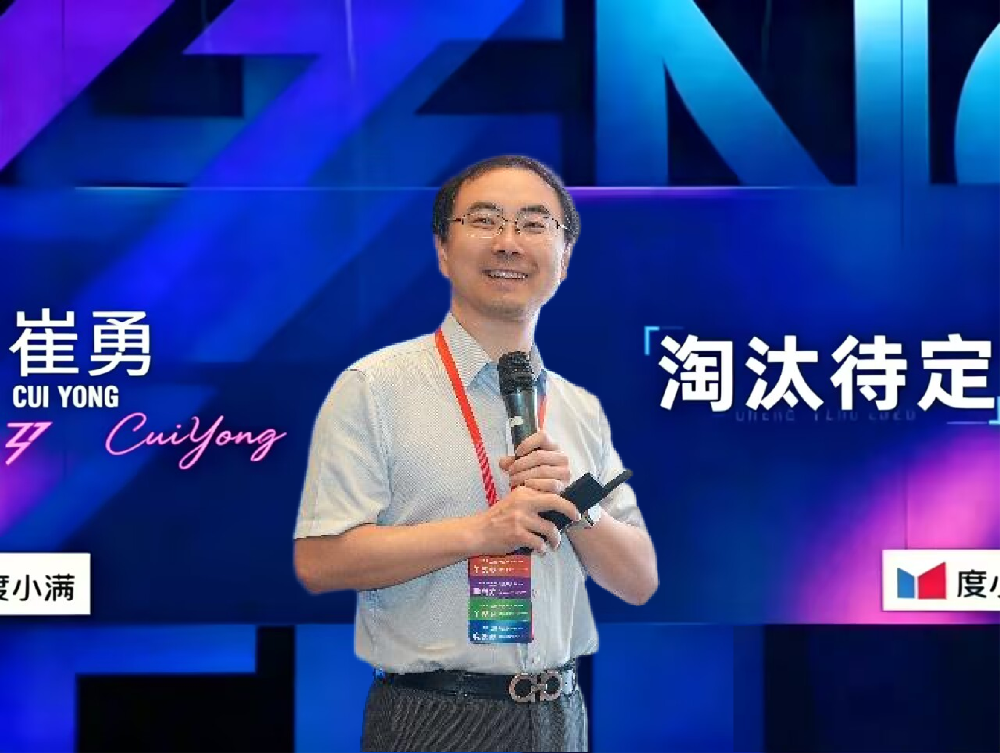

从夯到拉评价我上过的清华大学大一下课程：

- **「离散数学 2」崔勇 / 1.0**

实至名归。

不知道老师在讲什么，教材写的是什么，也不知道要学什么。作业也老是搞一些诸如「假如我是欧拉」「图论应用技术报告」这种莫名其妙的东西。

什么叫根树是叶向树？？？

起的名字也难听的要死 ~~（跟隔壁数分高代完全比不过）~~，什么 H 回路，分支定界法，便宜算法都来了。

独一档的防自学机制，能够让本来懂的人变得不懂。

不知道这种课还有什么开的必要。

- **「大学生心理训练与潜能开发」臧伟伟 / 1.5**

课堂很水，基本不用听。

但是作为一门 1 学分的课搞那么多东西干什么？？？一次小组 pre，一份（另外的）小组作业，一份个人的 1k 字报告，还要搞一次选做作业。感觉各种任务布置下去也是不明不白的，也没学到什么东西。

小组 pre 也是糊弄过去了，完全没有上学期小组任务那种大家都很团结，激动，开心，有成就感的感觉。大家都很松弛，也都是随便搞一搞就过去了。大家的即兴表演能力很厉害！

感觉放到前八周体感会好很多，可惜这是后八周开课。

- **「大学物理 B (1)」莫宇翔 / 2.0**

好处：完全没考勤，不用签到。

~~所以我一个学期只来了两节课。~~

谁教你期中期末不让带计算器考试的？？？

老师非常喜欢考一些冷门的，从教材的某些犄角旮旯里面搬出来的东西，美名其曰「考察物理学常识」。想起了高中物理很多不好的回忆，~~比如永远选不对的第一题。~~

谁教你期中考非线性常微分方程的？？

我真不知道不带计算器怎么开根，怎么算圆周率。至于期末的热学和狭义相对论，不带计算器怎么考，我也是非常期待啊。

还好这个老师下个学期不教大学物理了。~~（这好像还是他第一次教大物，被精准狙击了）~~

- **「信息素养——学术研究的必要能力」韩丽风 / 2.5**

到底是谁安排的早八？？？你是说我要提前 20 分钟骑到图书馆上课吗。（已趋势）

任务量很小（吗？），八周总共三次作业，基本都是基础的查查文献之类的。但是第一次作业老师也没讲清楚要弄什么，导致我还被打回去重写了。

说起来我平时基本都不去图书馆的，这门课确实让我好好的欣赏了图书馆周边的风景，感觉很出片！

本来它应该在更上面的位置，但是辩论赛输了导致评分 -0.5。

- **「数学分析 2」陈大广 / 2.7**

这个学期的数分感觉比上个学期的要难特别多，也是花了很多功夫啃下来。

不过这个学期的学习路径其实挺通顺的，多元拓扑 → 多元极限 → 多元函数和映射 → 多元微分 → 重积分 → 曲线和曲面积分 → 微分形式 → 向量场。现在看来其实很多步骤都有非常明确的几何直观（说的就是你微分形式！），如果把它啃下来我觉得是非常有意思的，也很好。

其实数分讲义完全没有必要写的那么形式化，毕竟这是教材不是论文。很多时候加一些必要的几何直观解释我认为对这个学期来说是非常有必要的。

~~学到最后发现题目里面最难的部分是上个学期的一元函数积分学~~

期中是 3h 作业大默写。期末很有可能变成 3h 计算大比拼。

- **「高等线性代数 2」徐帆 / 3.0**

这个学期高代教材的逻辑明显比上个学期要通顺的多，整个内容也都是串联在一起的，全部学完很有成就感。

感觉高代里面的名词都很酷！such as：二次型，正交算子，酉变换，自伴随算子，复正规算子，实正规矩阵，奇异值分解，谱分解，极分解，双线性型，纯量积，辛几何 ……

高代和数分比起来就更加有一种「小学奥数」的风味。很多题技巧性很强，需要一些（大量！）二级结论，可能还需要一些灵光一闪。

徐帆你的考试能不能出简单一点 $Q^{T}AQ$ ！！！我下个学期还要学你的抽代来着！

- **「英语阅读写作 B」Grima John Paul Christopher / 3.2**

相比其他（我室友）的英语阅读写作老师来说，整个任务量相当轻松。

整个学期只用完成一篇论文，几次小小练习，和一次不计分的 pre。

老师看起来挺松弛的，我也很松弛，好像也不需要怎么听课 ~~（也没听懂就是了）~~。

但是小组 pre 说实话体验不太好。尤其是 ai 生成的一坨稀烂的 ppt，不知道在干什么。要敷衍也不能敷衍成这个样子吧。（个人评分 -0.5）

- **「中国近现代史纲要」吴起民 / 4.0**

非常好老师！上课上的非常有意思（虽然我也没怎么听），也非常尊重学生的看法，对于作业和考试的安排都是让我们投票表决的。

任务量也很轻松，期中用 ai 生成一段小视频，期末完成听课感想 + 一篇小论文就行，没有小组作业，也没有期末考试。

这个学期让我比较遗憾的可能就是他上课的时间我基本用来干其他事了（都怪星期二的数学分析课！），没有认真听课。总之无脑报他的课就好，老师人很善良的！

我看其他同学有进行了课后反馈的，老师还会专门进行邮件回复，每次课上还会进行分享，非常用心！课件也是非常的用心，整个人都很有自己的想法，非常有「活人感」！

- **「形势与政策」潘一坡 / 4.5**

所有人！！都！给！我！报！潘！一！坡！！！

潘一坡是我男神。

上个学期就上了他的《思想道德与法治》~~（笑死，居然成最后一届上这门课的了）~~ ~~（也是辛苦潘老师了，他做的全新备课和全新 ppt 只存活了一个学期）~~ ，整个人超级好！还想着能不能继续上他的课，没想到这个学期形策就选上了，非常棒！

我承认形势与政策的小组任务是整个学期所有小组任务里面体验最好的。分工和任务都很明确，能够采访到鸟类学的教授更是荣幸。感觉真的了解到了很多全新的东西！

潘老师也很认真！在我们写完小组报告和个人报告之后，都会认真阅读然后一对一进行邮件反馈。虽然只是一门 1 学分，只有两次线下的 PF 小课，但是老师真的非常认真的在准备。

- **「体育」张培萌（体育助教：王文昊）/ 5.0**

选到他真的有福了！非常轻松愉快，基本上跑几圈，做完热身之后就会直接打篮球，每次都提前半个小时就下课了。真的真的真的非常轻松！整个体育课的氛围也很好，我这次抽到的是篮球，大家也都非常有序，如果打累了就直接坐在旁边休息就行了。

体育考试也是发挥出了历史最好战绩！三步上篮五进四，引体向上做了八个（感谢体育老师放大水），跑步也跑进了 6.90s（感谢体育老师放大水）。算了算体育好像能上 3.0？

我们这一年的体育助教也特别好，整个集体训练的氛围是很好的，训练非常扎实，但不会刻意难为人，整体效果还是很好的。体验到了很多不同种类的运动，比如桌球、游泳、攀岩、滑冰等等。居然还能报销！非常棒集体锻炼。

