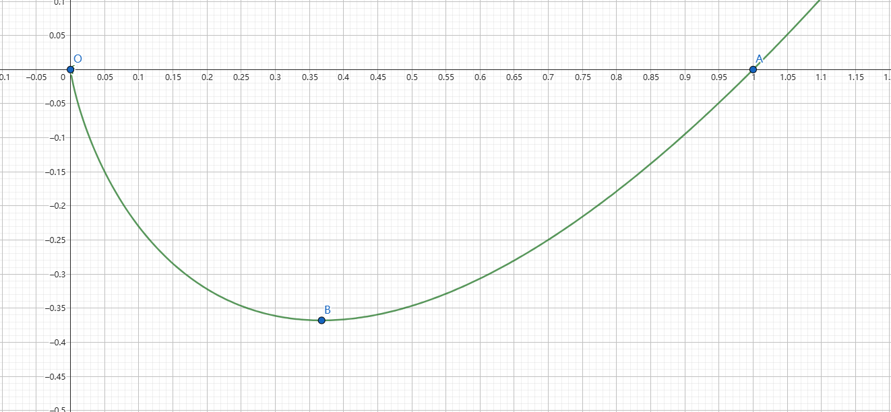
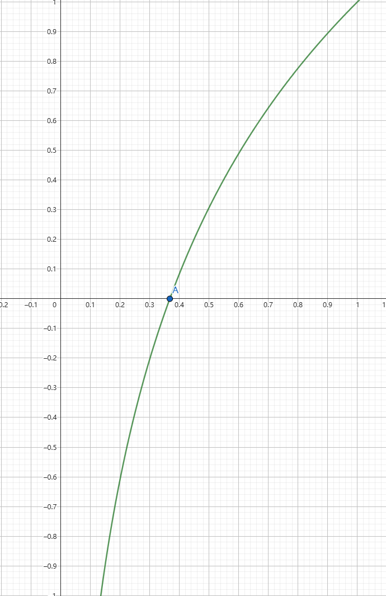
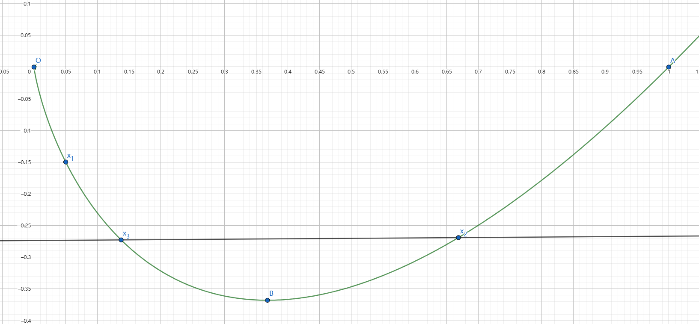
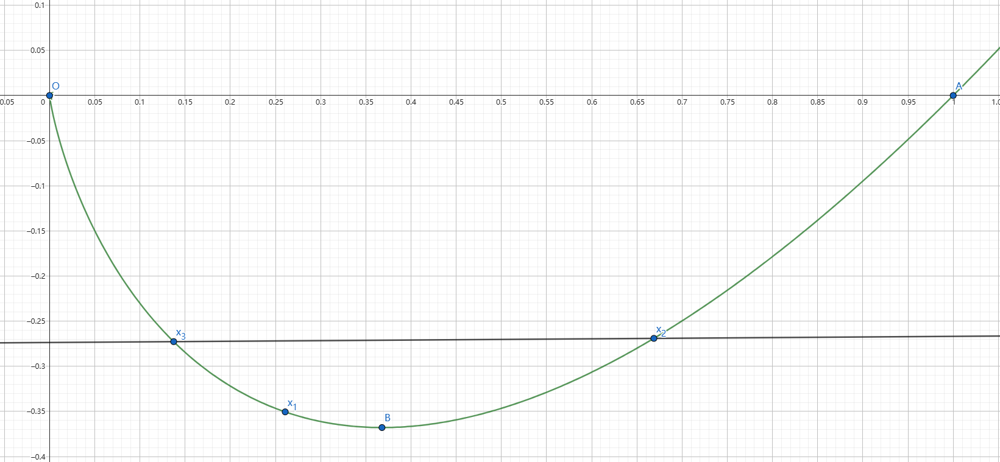
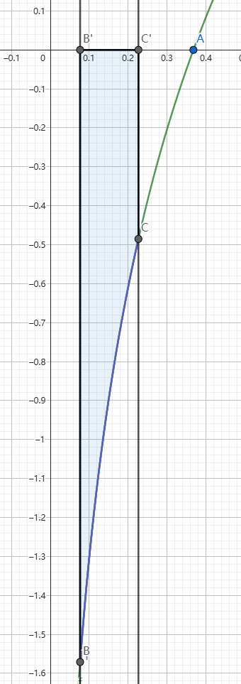
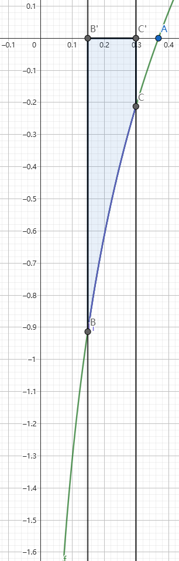
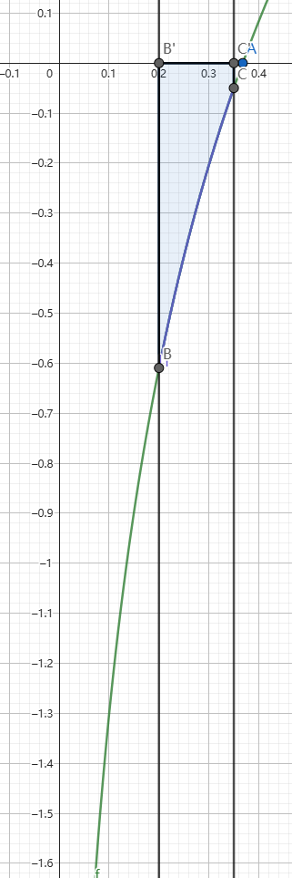

---

title: 利用调整法解决一系列极值点偏移问题

date: 2024-11-28

tags:
 - 数学

---

### 前言

21 世纪最重要的品质——淡定

> 什么是调整法？

调整法，顾名思义，就是在已有决策上调整，通过对原决策和调整后决策的比较，**排除对答案没有用的情况，保留真正有价值的情况**。调整法适用于一系列的最优化问题和证明问题。

> 设 $f(x)=x\ln x$，若 $x_1,x_2\in(0,1)$，证明：$|f(x_1)-f(x_2)|\le h(|x_1-x_2|)$。
>
> 其中 $h(x)$ 是一个满足随 $x$ 单调递增的函数，大部分题目中 $h(x)=x$，本题中 $h(x)=\sqrt x$。

前置准备：

|                $f(x)$                 |            $f'(x)=\ln x+1$            |
| :-----------------------------------: | :-----------------------------------: |
|  |  |

根据洛必达原理，$\lim_{x\to 0}f(x)=\lim_{x\to 0}\dfrac{\ln x}{\frac{1}{x}}=\lim_{x\to 0}\dfrac{\frac{1}{x}}{-\frac{1}{x^2}}=0$，$f(1)=0$，极值点 $B(\dfrac{1}{e},-\dfrac{1}{e})$。

不妨令 $x_2>x_1$。

### 第一步调整

我们先证明：**当 $x_2>\dfrac{1}{e}$，$x_1\le \dfrac{1}{e}$ 时（也就是 $x_1,x_2$ 分别在极值点两侧时）的情况不影响答案。**

|   图 1   | 图 2 |
| :------: | :-------------------------------------: |
|  |    |

找到一个点 $x_3$ 满足 $x_3<\dfrac{1}{e}$ 且 $f(x_2)=f(x_3)$。如图 1，当 $x_1<x_3$ 时，显然有 $|x_1-x_3|<|x_1-x_2|$。也就是说，**如果 $|f(x_1)-f(x_3)|<h(|x_1-x_3|)$，那么必然有 $|f(x_1)-f(x_2)|<h(|x_1-x_2|)$**。

但如果 $x_1>x_3$（图 2）时，是否还能有 $|x_1-x_3|<|x_1-x_2|$ 这么好的性质呢？当然有。

我们先证明一个极值点偏移：

> **引理：$x_2+x_3>\dfrac{2}{e}$。**这个引理的等价表述是 $|x_2-\dfrac{1}{e}|<|x_3-\dfrac{1}{e}|$。
>
> 即证 $x_2>\dfrac{2}{e}-x_3$。因为 $x_3\in(0,\dfrac{1}{e})$，所以 $\dfrac{2}{e}-x_3>\dfrac{1}{e}$，它们都在极值点右侧，所以可以转化为 $f(x_2)>f(\dfrac{2}{e}-x_3)$，即 $f(x_3)>f(\dfrac{2}{e}-x_3)$。
>
> 令 $F(x)=f(x)-f(\dfrac{2}{e}-x)\ \ \ (x\in (0,\dfrac{1}{e}])$，$F'(x)=\ln x+\ln (\dfrac{2}{e}-x)+2=\ln(x\cdot(\dfrac{2}{e}-x))+2$。
>
> 根据均值不等式，$x\cdot(\dfrac{2}{e}-x)\le \dfrac{1}{e^2}$，所以 $F'(x)\le \ln(\dfrac{1}{e^2})+2=0$，所以 $F(x)\ge F(\dfrac{1}{e})=0$。
>
> 又因为 $x_3<\dfrac{1}{e}$，有 $f(x_3)>f(\dfrac{2}{e}-x_3)$，即 $x_2+x_3>\dfrac{2}{e}$ 成立。

所以，我们有：$|x_1-x_2|\ge |x_2-\dfrac{1}{e}|\ge |x_3-\dfrac{1}{e}|\ge |x_1-x_3|$。性质仍然成立。

综上，所有 $x_1,x_2$ 横跨极值点的情况都不优于 $x_1,x_2$ 在同一侧的情况，不用再讨论下去。

### 第二步调整

我们接着讨论 $x_2\le \dfrac{1}{e}$ 的情况。首先进行感性理解：

|                  图 1                   |                  图 2                   |                  图 3                   |
| :-------------------------------------: | :-------------------------------------: | :-------------------------------------: |
|  |  |  |

观察 $f'(x)$ 的图像，我们发现如果固定了 $|x_1-x_2|$ 的值，那么它们对应点围成的曲面梯形面积随着 $x_1$ 的右移在不断减小，也就意味着 $|f(x_2)-f(x_1)|$ 在越来越小。根据调整法，我们应该要尽量让这个值大一些，把情况往最严格的地方卡。因此，我们如果能够证明 $\forall x\in(0,\dfrac{1}{e}]$，都有 $|f(x)|\le h(x)$ 的话，整个 $x_2\le \dfrac{1}{e}$ 都是合法的。

$x_1\ge\dfrac{1}{e}$ 的情况也是如此，如果能够证明 $\forall x\in [\dfrac{1}{e},1)$，都有 $|f(x)|\le h(1-x)$ 的话，这一部分的情况也都是合法的。

下面我们来理性证明一下：

> **引理：$|f(x_1)-f(x_2)|\le |f(x_2-x_1)|$**。
>
> **法一：**由于 $f'(x)=\ln x+1$ 单调递增且在 $(0,\dfrac{1}{e})$ 内的值 $<0$，所以 $\forall x\in(x_1,\dfrac{1}{e})$ 都有 $f'(x)>f'(x-x_1)$。
>
> 所以有 $\mid_{0}^{x_2-x_1}f'(x)<\mid_{x_1}^{x_2}f'(x)$，即 $f(x_2-x_1)<f(x_2)-f(x_1)$。又因为 $f(x)$ 在 $(0,\dfrac{1}{e})$ 单调递减且值恒小于 0，所以有 $|f(x_1)-f(x_2)|\le |f(x_2-x_1)|$。
>
> **法二：**令 $x_1=a,x_2-x_1=b$，即证 $f(a)+f(b)\le f(a+b)$。也就是 $a\ln a+b\ln b\le (a+b)\ln(a+b)$。同时取对数，$e^{a\ln a+b\ln b}=(e^{\ln a})^a\times (e^{\ln b})^b=a^a\times b^b$，同理 $e^{(a+b)\ln (a+b)}=(a+b)^{a+b}$。
>
> 根据均值不等式， $a^a\times b^b\le (\dfrac{a^2+b^2}{a+b})^{a+b}=(a+b-\dfrac{2ab}{a+b})^{a+b}<(a+b)^{a+b}$，成立！

根据调整法，如果 $|f(x_2-x_1)|\le h(|x_2-x_1|)$，那么一定有 $|f(x_1)-f(x_2)|\le h(|x_2-x_1|)$。所以我们只需要讨论 $|f(x)|$ 与 $h(x)$ 的大小关系即可。

对于 $x_1\ge\dfrac{1}{e}$ 的情况同理，可以证明 $|f(x_1)-f(x_2)|\le |f(1)-f(1-|x_1-x_2|)|$，只需判断 $f(x)$ 与 $h(1-x)$ 的大小关系即可。

### 最后的计算

- **Part 1：证明 $-x\ln x<\sqrt x\ \ \ (x\in (0,\dfrac{1}{e}])$**

即证 $\sqrt x\ln \sqrt x>-\dfrac{1}{2}$。令 $t=\sqrt x\in(0,\dfrac{\sqrt e}{e})$，即证 $t\ln t>-\dfrac{1}{2}$。这不就是 $f(t)$ 吗？显然有 $-\dfrac{1}{e}>-\dfrac{1}{2}$，成立！

- **Part 2：证明 $-x\ln x<\sqrt{1-x}\ \ \ (x\in [\dfrac{1}{e},1))$**

即证 $x^2\ln^2 x<1-x$，即证 $\ln^2 x+\dfrac{1}{x}-\dfrac{1}{x^2}<0$（设为 $g(x)$）。$g'(x)=\dfrac{2\ln x}{x}-\dfrac{1}{x^2}+\dfrac{2}{x^3}=\dfrac{1}{x^3}(2x^2\ln x-x+2)$。考虑分析 $\varphi(x)=2x^2\ln x-x+2$。利用对数均值不等式 $\ln x>\dfrac{2(x-1)}{x+1}$，$\varphi(x)>2x^2\dfrac{2(x-1)}{x+1}-x+2=(x+1)[4x^2(x-1)+(x+1)(2-x)]=(x+1)[4x^3-5x^2+x+2]$。分析 $y=4x^2-5x+1$，对称轴为 $x=\dfrac{5}{8}$，此时 $y=-\dfrac{9}{25}$，那显然 $y>-2$，所以 $\varphi(x)>0$，$g'(x)>0$，只需要考虑 $x=1$ 的情况，恰好 $g(1)=0$，成立！

（相信有更加简单的办法）

综上，$|f(x_1)-f(x_2)|\le h(|x_1-x_2|)$，成立！